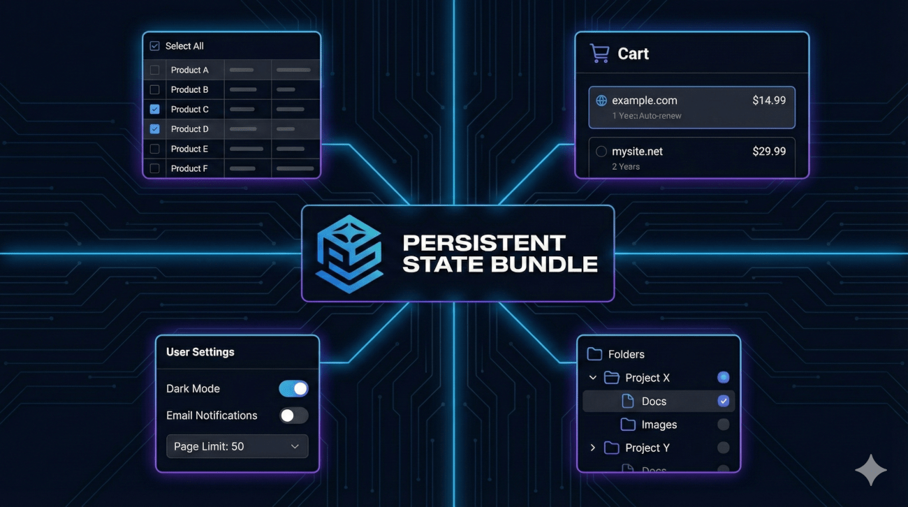

# Persistent State Bundle

<p align="center">
<br>
</p>

This bundle provides a unified and robust solution for managing persistent user interface state in Symfony applications. It covers two key areas: Selections for efficient
handling of bulk operations (e.g., "Select All" across pagination) and Preferences for storing key-value settings. With a flexible architecture based on context
resolvers (e.g., binding to a user or company) and support for various storage backends (Session, Redis, Doctrine), it allows you to elegantly solve UI state persistence
without cluttering your controllers with boilerplate code.

## Scenario 1 - Chart

```php
class MyController{

    public function __construct(
        private readonly SelectionManagerInterface $selectionManager,
    ) {}
    public function select(User $user, Product $product){
        
        $cartSelection = $this->selectionManager->getSelection($user,"cart");
        
        $cartSelection->select($product, [
            'quantity' => $request->get('qty', 1),
            'added_at' => new \DateTime()
        ]);
        $cart->destroy();
    }
    
    public function getCart(){
        $cartSelection = $this->selectionManager->getSelection($user,"cart");
        return $companySelection->getSelected();
    }
    
    public function clearCart() {
        $cartSelection = $this->selectionManager->getSelection($user,"cart");
        $cart->destroy();
    }
}
```

## Scenario 2 - Preferences

```php
class MyController{

    public function __construct(
        private readonly PreferenceManagerInterface $prefManager,
    ) {}
    public function save(User $user){
        
        $preferences = $this->prefManager->getPreference($user);
        
        $preferences->set('foo', 'bar');
        $preferences->set('baz', [1,2,3]);
        
        $foo = $preferences->get('foo');
        $baz = $preferences->get('baz');
    }
    
}
```

```twig
<div>
    User Foo: {{ preference(user, 'foo') }}<br>
    Company pref: {{ company|pref('foo2') }}
</div>
```

## Scenario 3 - Bulk Actions

```twig
<div persistent_selection_stimulus_controller("main_logs", null,{
	selectAllClass:'btn-primary',
	unselectAllClass:'btn-outline-secondary',
},"default",true)>
        {# SELECT ROWS ON CURRENT PAGE #}
            <button
                    class="btn btn-primary btn-sm text-nowrap m-1"
                    data-action="{{ persistent_selection_stimulus_controller_name }}#selectCurrentPage"
            >
                {{ 'Select visible'|trans }}
            </button>
        {# SELECT ROWS ALL PAGES #}
            <button
                    class="btn btn-primary btn-sm text-nowrap  m-1"
                    data-action="{{ persistent_selection_stimulus_controller_name }}#selectAll"
            >
                {{ 'Select all'|trans }}
            </button>
        </div>

    </div>
    <ul class="list-group">
        
            <li>
                {{ persistent_selection_row_selector("main_logs",log,{class:"m-1 align-bottom"}) }}
                {{ log.name }}
            </li>
        
    </ul>
</div>
```
```php
class MyController{
    public function __construct(
        private readonly SelectionManagerInterface $selectionManager,
        private readonly EntityManagerInterface $em,
    ) {}
    public function performAction(User $user, Product $product){
        
        $logsSelection = $this->selectionManager->getSelection($user,"main_logs");
        
        foreach($logsSelection->getSelectedIdentifiers() as $logId){
            $this->em->remove($this->em->getReference(Log::class,$logId));
        }
    }
    
}
```

## Full documentation

See [docs/full_config.md](docs/full_config.md) 
